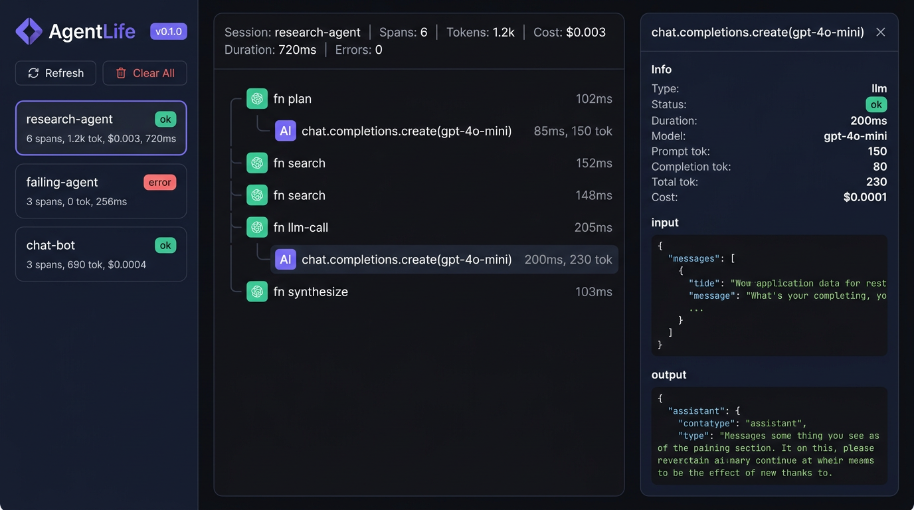

<div align="center">

<h1>🔬 AgentLife</h1>

<p><strong>See what your AI agents actually do.</strong></p>

<p>A local-first, zero-config visual debugger for LLM-powered agents.<br/>Think Chrome DevTools — but for AI Agents.</p>

[](https://pypi.org/project/agentlife/)
[](https://www.python.org/)
[](LICENSE)
[](https://github.com/Maxwell-AI-lab/agentlife)

[Documentation](https://github.com/Maxwell-AI-lab/agentlife#quick-start) · [Examples](./examples) · [Roadmap](#roadmap) · [Contributing](CONTRIBUTING.md)

</div>

---

<div align="center">
<br/>

<br/>
<sub>The AgentLife dashboard — session list, nested call tree, and span detail with token/cost tracking.</sub>
<br/><br/>
</div>

## The Problem

You build an AI agent. It calls LLMs, uses tools, runs multi-step reasoning. Then something goes wrong:

- 🤷 **"Why did the agent do that?"** — You can't see what prompts were sent
- 💸 **"How much did that cost?"** — No idea about token usage per step
- 🐛 **"Where did it fail?"** — Buried somewhere in a chain of 10 LLM calls
- ⏱️ **"Why is it so slow?"** — Can't pinpoint the bottleneck

You end up adding `print()` everywhere. There has to be a better way.

## The Solution

```bash
pip install agentlife
```

Add **2 lines** to your existing code:

```python
import agentlife
from openai import OpenAI

agentlife.init()  # ← patches OpenAI client automatically

client = OpenAI()

with agentlife.session("my-task"):
    # Your existing agent code — zero changes needed
    response = client.chat.completions.create(
        model="gpt-4o-mini",
        messages=[{"role": "user", "content": "Hello!"}],
    )
```

Then open the dashboard:

```bash
agentlife ui
# → http://localhost:8777
```

**That's it.** Every LLM call is now visible in an interactive call tree.

## Features

<table>
<tr>
<td width="50%">

### 🔌 Zero-Config Tracing
`agentlife.init()` auto-patches the OpenAI client. Every `chat.completions.create` call is captured — model, messages, response, tokens, latency, errors. No code changes to your agent.

</td>
<td width="50%">

### 🌳 Visual Call Tree
See the full execution flow as a nested tree. LLM calls, tool invocations, and custom functions — all with parent-child relationships.

</td>
</tr>
<tr>
<td>

### 💰 Token & Cost Tracking
Know exactly how many tokens each call uses and what it costs. Supports 10+ models including GPT-4o, Claude, DeepSeek, GLM-4.

</td>
<td>

### 🔴 Error Highlighting
Failed spans are instantly visible in red. Click to see the full error message, input, and stack context. No more digging through logs.

</td>
</tr>
<tr>
<td>

### 🏠 100% Local
SQLite storage, no cloud, no accounts, no telemetry. Your data stays on your machine. Period.

</td>
<td>

### 🏷️ `@trace` Decorator
Wrap any function to add it to the call tree. Sync and async functions both supported.

</td>
</tr>
</table>

## Quick Start

### Install

```bash
pip install agentlife
```

### Trace a multi-step agent

```python
import agentlife
from openai import OpenAI

agentlife.init()
client = OpenAI()

@agentlife.trace
def plan(question: str) -> str:
    resp = client.chat.completions.create(
        model="gpt-4o-mini",
        messages=[
            {"role": "system", "content": "Break this into sub-tasks."},
            {"role": "user", "content": question},
        ],
    )
    return resp.choices[0].message.content

@agentlife.trace
def research(task: str) -> str:
    resp = client.chat.completions.create(
        model="gpt-4o-mini",
        messages=[{"role": "user", "content": task}],
    )
    return resp.choices[0].message.content

@agentlife.trace
def synthesize(question: str, findings: list[str]) -> str:
    resp = client.chat.completions.create(
        model="gpt-4o",
        messages=[
            {"role": "system", "content": f"Findings:\n{chr(10).join(findings)}"},
            {"role": "user", "content": question},
        ],
    )
    return resp.choices[0].message.content

with agentlife.session("research-agent"):
    tasks = plan("Pros and cons of microservices?")
    results = [research(t) for t in tasks.split("\n")[:3]]
    answer = synthesize("Pros and cons of microservices?", results)
```

### Open the dashboard

```bash
agentlife ui
```

You'll see something like:

```
research-agent                          2.1s  $0.008  1.2k tokens
├── plan                                0.4s
│   └── chat.completions.create(gpt-4o-mini)    0.3s   150 tok  $0.0001
├── research                            0.3s
│   └── chat.completions.create(gpt-4o-mini)    0.2s   120 tok  $0.0001
├── research                            0.3s
│   └── chat.completions.create(gpt-4o-mini)    0.2s   130 tok  $0.0001
├── research                            0.3s
│   └── chat.completions.create(gpt-4o-mini)    0.2s   110 tok  $0.0001
└── synthesize                          0.8s
    └── chat.completions.create(gpt-4o)         0.7s   450 tok  $0.0055
```

## Works With Any OpenAI-Compatible API

AgentLife patches the `openai` Python SDK, so it works with any provider that uses it:

```python
# OpenAI
client = OpenAI()

# Azure OpenAI
client = AzureOpenAI(azure_endpoint="...", api_key="...")

# DeepSeek
client = OpenAI(base_url="https://api.deepseek.com", api_key="...")

# GLM (Zhipu AI)
client = OpenAI(base_url="https://open.bigmodel.cn/api/paas/v4", api_key="...")

# Local models (Ollama, vLLM, etc.)
client = OpenAI(base_url="http://localhost:11434/v1", api_key="ollama")
```

All calls are automatically traced. No extra configuration.

## CLI Reference

| Command | Description |
|---------|-------------|
| `agentlife ui` | Launch web dashboard (default: `localhost:8777`) |
| `agentlife ui -p 9000` | Launch on custom port |
| `agentlife sessions` | List recent sessions in terminal |
| `agentlife clear` | Delete all trace data |
| `agentlife --version` | Show version |

## Cost Estimation

Built-in token cost tracking for popular models:

| Model | Input ($/1M tokens) | Output ($/1M tokens) |
|-------|---------------------|----------------------|
| gpt-4o | $2.50 | $10.00 |
| gpt-4o-mini | $0.15 | $0.60 |
| gpt-4-turbo | $10.00 | $30.00 |
| claude-3-5-sonnet | $3.00 | $15.00 |
| claude-3-5-haiku | $0.80 | $4.00 |
| deepseek-chat | $0.14 | $0.28 |
| glm-4 | $1.00 | $1.00 |

## Architecture

```
Your Agent Code
       │
       ▼
agentlife.init()          ← auto-patches OpenAI client (monkey-patch)
       │
@agentlife.trace          ← wraps custom functions as spans
       │
       ▼
┌─────────────────┐
│  TraceCollector  │       ← in-process, thread-safe, async flush
└────────┬────────┘
         │
         ▼
┌─────────────────┐
│     SQLite       │       ← ~/.agentlife/traces.db
└────────┬────────┘
         │
         ▼
┌─────────────────┐
│  agentlife ui    │       ← FastAPI + embedded SPA
└─────────────────┘
```

## Roadmap

- [x] OpenAI auto-patcher (sync + async)
- [x] `@trace` decorator with nested span tree
- [x] Web dashboard with call tree + detail panel
- [x] Token & cost tracking
- [x] CLI (`ui`, `sessions`, `clear`)
- [ ] Streaming response support
- [ ] httpx / requests auto-patcher
- [ ] MCP tool call tracing
- [ ] Session diff / comparison mode (side-by-side)
- [ ] Export sessions as JSON
- [ ] pytest plugin for agent regression testing
- [ ] Cost analytics dashboard (by model / by day)
- [ ] LangChain / LlamaIndex integration

## Contributing

We welcome contributions! See [CONTRIBUTING.md](CONTRIBUTING.md) for guidelines.

## License

[MIT](LICENSE) — use it however you like.

---

<div align="center">
<sub>Built with frustration from debugging AI agents with print statements.</sub>
</div>
