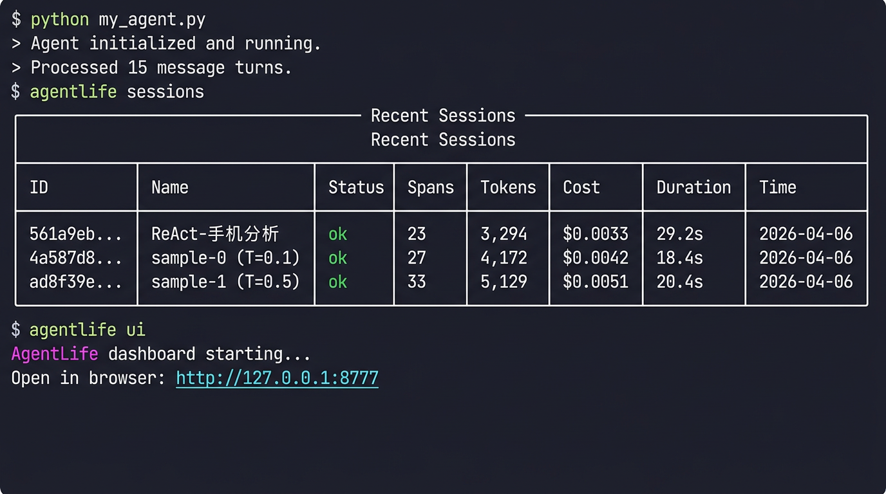
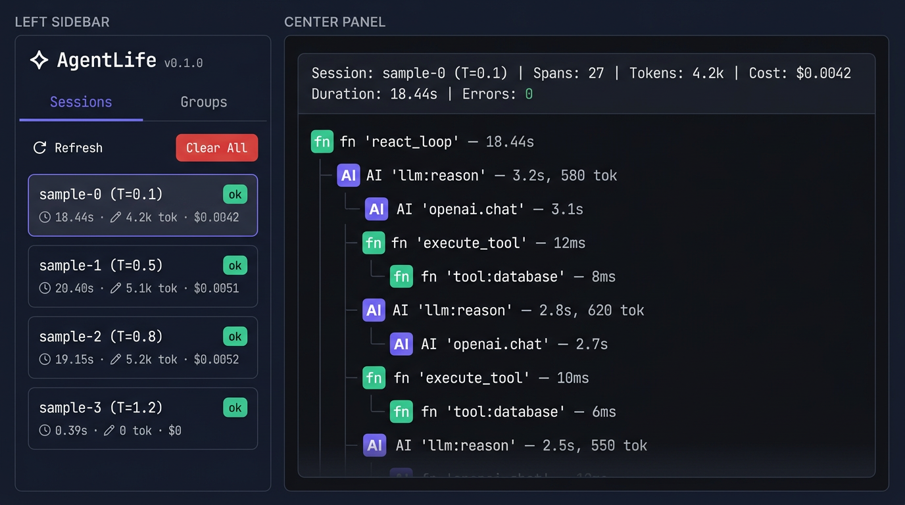
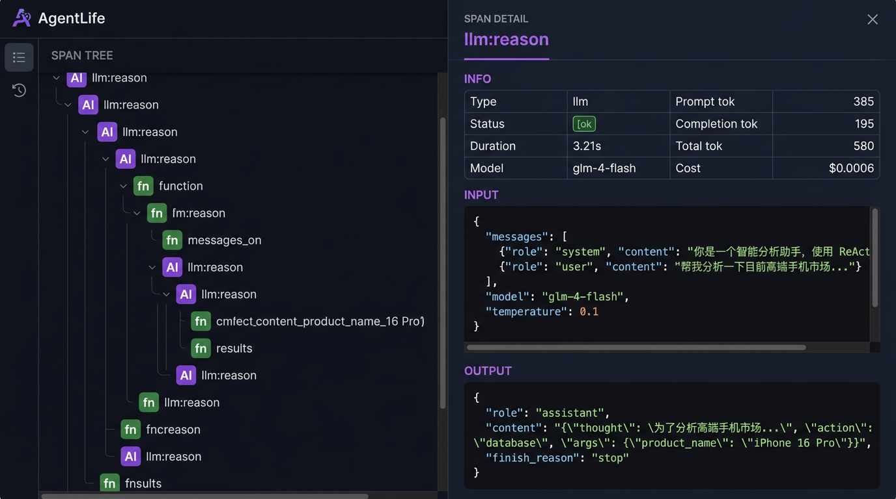
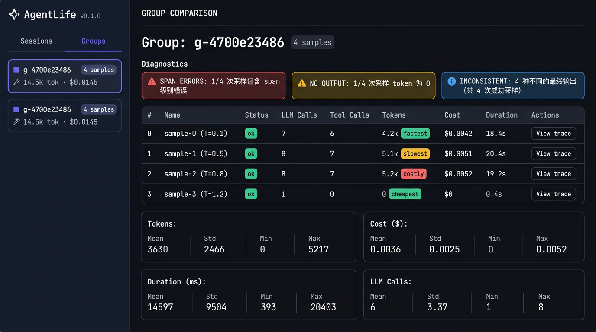

<div align="center">

<h1>🔬 AgentLife</h1>

<p><strong>See what your AI agents actually do.</strong></p>

<p>A local-first, zero-config visual debugger for LLM-powered agents.<br/>Think Chrome DevTools — but for AI Agents.</p>

[](https://pypi.org/project/agentlife/)
[](https://www.python.org/)
[](LICENSE)
[](https://github.com/Maxwell-AI-lab/agentlife)

[Quick Start](#quick-start) · [Who Is This For](#who-is-this-for) · [Examples](./examples) · [Roadmap](#roadmap) · [Contributing](CONTRIBUTING.md)

</div>

---

## The Problem

You build an AI agent. It calls LLMs, uses tools, runs multi-step reasoning. Then something goes wrong:

- 🤷 **"Why did the agent give a wrong answer?"** — You can't see what prompts were sent at each step
- 💸 **"How much did that cost?"** — No idea about token usage per step
- 🐛 **"Which step failed?"** — Buried somewhere in a chain of 10 LLM calls
- 🔄 **"Why do 4 rollouts give 4 different answers?"** — No way to compare them side-by-side

You end up adding `print()` everywhere. There has to be a better way.

## The Solution: 2 Lines of Code

```bash
pip install agentlife
```

```python
import agentlife          # ← line 1
agentlife.init()          # ← line 2, auto-patches OpenAI client

# Your existing agent code — zero changes needed
client = OpenAI()
with agentlife.session("my-task"):
    response = client.chat.completions.create(
        model="gpt-4o-mini",
        messages=[{"role": "user", "content": "Hello!"}],
    )
```

```bash
agentlife ui    # → open http://localhost:8777
```

<div align="center">

<br/><sub>Run your agent, then inspect with <code>agentlife sessions</code> or <code>agentlife ui</code>.</sub>
<br/><br/>
</div>

**Every LLM call is now visible in an interactive call tree:**

<div align="center">

<br/><sub>Session list + nested call tree — see every LLM call, tool invocation, and function in context.</sub>
<br/><br/>
</div>

---

## Who Is This For

### 🛠️ Agent Developer — "My agent gives wrong answers, where did it go wrong?"

The most common use case. Add `agentlife.init()` at the top, wrap your agent run in `agentlife.session()`, and open the dashboard. You'll see:

- Every LLM call's **full prompt and response**
- The complete **nested call tree** showing execution order
- **Token count, cost, and latency** per step
- **Errors highlighted in red** — click to inspect

```python
import agentlife
agentlife.init()

with agentlife.session("debug-my-agent"):
    result = my_agent.run("Book a flight to Tokyo")
    # Something went wrong? Open agentlife ui to find out exactly where.
```

<div align="center">

<br/><sub>Click any span to see full input/output, model, tokens, cost, and errors.</sub>
<br/><br/>
</div>

### 🔬 RL Researcher — "Compare N rollout samples side-by-side"

Training agents with reinforcement learning? Use `agentlife.group()` to compare multiple rollouts of the same prompt:

```python
import agentlife
agentlife.init()

with agentlife.group("batch-001"):
    for i in range(4):
        with agentlife.session(f"sample-{i}", sample_index=i):
            trajectory = agent.rollout(prompt, temperature=temperatures[i])
```

The **Groups** tab gives you:
- **Comparison table** — tokens, cost, duration, LLM calls per sample
- **Auto-diagnostics** — flags errors, outliers, and inconsistent outputs
- **Aggregate statistics** — mean, std, min, max across samples
- **Output comparison** — see final answers side-by-side

<div align="center">

<br/><sub>N-Sample comparison with diagnostics, statistics, and output diff.</sub>
<br/><br/>
</div>

### 💰 AI Team — "Where is the money going?"

Before going to production, run your test suite through AgentLife to understand cost distribution:

```python
for query in test_queries:
    with agentlife.session(query[:30]):
        agent.run(query)

# Then: agentlife sessions — shows cost, tokens, duration for each
```

### 🔗 Framework User — "I use LangChain/CrewAI but can't see what's happening inside"

AgentLife patches the OpenAI Python SDK at runtime. If your framework uses it internally, **all LLM calls are automatically traced — zero code changes to the framework**:

```python
agentlife.init()  # That's it — works with LangChain, CrewAI, AutoGen, etc.
```

---

## Features

| Feature | Description |
|---------|-------------|
| **🔌 Zero-Config Tracing** | `agentlife.init()` auto-patches the OpenAI client. Every `chat.completions.create` is captured — model, messages, response, tokens, latency, errors. |
| **🌳 Visual Call Tree** | See execution flow as a nested tree. LLM calls → tool calls → custom functions, all with parent-child relationships. |
| **💰 Token & Cost Tracking** | Per-step token count and cost estimation. Supports GPT-4o, Claude, DeepSeek, GLM-4, and more. |
| **📊 N-Sample Group Comparison** | `agentlife.group()` groups multiple rollouts. Compare tokens, cost, duration, outputs across samples with auto-diagnostics. |
| **🔴 Error Highlighting** | Failed spans shown in red. Click to see full error, input context, and stack. |
| **🏷️ `@trace` Decorator** | Wrap any function (sync or async) to add it to the call tree. |
| **🏠 100% Local** | SQLite storage, no cloud, no accounts, no telemetry. Your data stays on your machine. |
| **🔧 Auto-Diagnostics** | Flags: failed samples, token outliers, slow rollouts, inconsistent outputs, zero-token API failures. |

## Quick Start

### Install

```bash
pip install agentlife
```

### Trace a multi-step agent

```python
import agentlife
from openai import OpenAI

agentlife.init()
client = OpenAI()

@agentlife.trace
def plan(question: str) -> str:
    resp = client.chat.completions.create(
        model="gpt-4o-mini",
        messages=[
            {"role": "system", "content": "Break this into sub-tasks."},
            {"role": "user", "content": question},
        ],
    )
    return resp.choices[0].message.content

@agentlife.trace
def research(task: str) -> str:
    resp = client.chat.completions.create(
        model="gpt-4o-mini",
        messages=[{"role": "user", "content": task}],
    )
    return resp.choices[0].message.content

with agentlife.session("research-agent"):
    tasks = plan("Pros and cons of microservices?")
    results = [research(t) for t in tasks.split("\n")[:3]]
```

### Compare N rollout samples

```python
import agentlife
agentlife.init()

with agentlife.group("experiment-1"):
    for i in range(4):
        with agentlife.session(f"sample-{i}", sample_index=i):
            result = agent.run(prompt, temperature=[0.1, 0.4, 0.7, 0.95][i])
```

### Open the dashboard

```bash
agentlife ui    # → http://localhost:8777
```

## Works With Any OpenAI-Compatible API

AgentLife patches the `openai` Python SDK, so it works with any provider that uses it:

```python
# OpenAI
client = OpenAI()

# Azure OpenAI
client = AzureOpenAI(azure_endpoint="...", api_key="...")

# DeepSeek
client = OpenAI(base_url="https://api.deepseek.com", api_key="...")

# GLM (Zhipu AI)
client = OpenAI(base_url="https://open.bigmodel.cn/api/paas/v4", api_key="...")

# Local models (Ollama, vLLM, etc.)
client = OpenAI(base_url="http://localhost:11434/v1", api_key="ollama")
```

All calls are automatically traced. No extra configuration.

## CLI Reference

| Command | Description |
|---------|-------------|
| `agentlife ui` | Launch web dashboard (default: `localhost:8777`) |
| `agentlife ui -p 9000` | Launch on custom port |
| `agentlife sessions` | List recent sessions in terminal |
| `agentlife clear` | Delete all trace data |
| `agentlife --version` | Show version |

## Architecture

```
Your Agent Code
       │
       ▼
agentlife.init()          ← auto-patches OpenAI client (monkey-patch)
       │
@agentlife.trace          ← wraps custom functions as spans
       │
       ▼
┌─────────────────┐
│  TraceCollector  │       ← in-process, thread-safe
└────────┬────────┘
         │
         ▼
┌─────────────────┐
│     SQLite       │       ← ~/.agentlife/traces.db (100% local)
└────────┬────────┘
         │
         ▼
┌─────────────────┐
│  agentlife ui    │       ← FastAPI + embedded SPA
└─────────────────┘
         │
         ▼
┌─────────────────┐
│    Browser       │       ← Sessions / Groups / Detail views
└─────────────────┘
```

## Roadmap

- [x] OpenAI auto-patcher (sync + async)
- [x] `@trace` decorator with nested span tree
- [x] Web dashboard with call tree + detail panel
- [x] Token & cost tracking (25+ models)
- [x] CLI (`ui`, `sessions`, `clear`, `export`)
- [x] N-Sample group comparison with diagnostics
- [x] Aggregate statistics (mean/std/min/max)
- [x] Auto-diagnostics (errors, outliers, inconsistency)
- [x] Streaming response support (`stream=True`)
- [x] Export sessions as JSON (`agentlife export`)
- [x] OpenAI Function Calling / tool_calls parsing
- [ ] MCP tool call tracing
- [ ] CSV export
- [ ] pytest plugin for agent regression testing
- [ ] Cost analytics dashboard (by model / by day)
- [ ] LangChain / LlamaIndex native integration
- [ ] Anthropic SDK native patcher
- [ ] Session replay mode

## Examples

| Example | Description |
|---------|-------------|
| [`basic_chat.py`](examples/basic_chat.py) | Simplest usage — trace a single LLM call |
| [`multi_step_agent.py`](examples/multi_step_agent.py) | Multi-step agent with nested `@trace` |
| [`react_agent.py`](examples/react_agent.py) | ReAct agent — multi-turn reasoning + tool calling |
| [`react_agent_nsample.py`](examples/react_agent_nsample.py) | **N-sample rollout** — 4 rollouts with different temperatures |
| [`demo_no_api.py`](examples/demo_no_api.py) | Mock demo — no API key needed |

## Contributing

We welcome contributions! See [CONTRIBUTING.md](CONTRIBUTING.md) for guidelines.

## License

[MIT](LICENSE) — use it however you like.

---

<div align="center">
<sub>Built with frustration from debugging AI agents with print statements.</sub>
</div>
